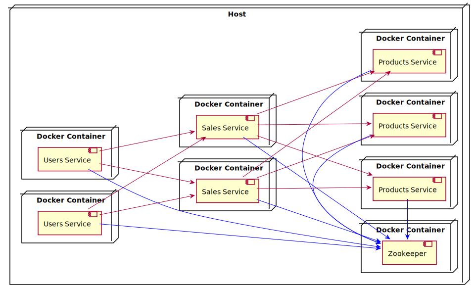

# Spring Cloud Zookeeper Demo

### Description

A multi-module project that demonstrates the usage of the `Spring Cloud Zookeeper` framework for service discovery and client-side load-balancing. The
project contains three modules/microservices listed in the table below:

| Module             | Description                                          |
|--------------------|------------------------------------------------------|
| users-service      | Contains data about the users and their purchases.   |
| sales-service      | Contains data about performed sales.                 |
| products-service   | Contains data about the sold products.               |

Every module/microservice is implemented as a Spring Boot application and uses the `spring-cloud-starter-zookeeper-discovery` for registering itself
with Zookeeper. The HTTP clients (RestTemplate and OpenFeign) are configured to use a `LoadBalancerClient`. The `LoadBalancerClient` queries Zookeeper
for the available instances of a certain service (e.g. products-service) and performs client-side load-balancing. The list of used
frameworks/technologies is:

```
  Java                      11
  Gradle                    6.5
  Spring Boot               2.2.8.RELEASE
  Spring Cloud              Hoxton.SR5
  Docker                    19.03.8
  Docker-Compose            1.25.5
```

### Building & Running the project

The complete project can be built with the following command executed at top level:

```shell
./gradlew clean build
```

The previous command will build all modules/microservices. Finally, we can start each microservice by executing the following command in the
corresponding module:

```shell
./gradlew bootRun
```

### Starting the microservices with Docker-Compose

In order to ease the configuration and startup of the microservices, we have containerized each microservice with Docker. Since the microservices
depend on each other and additionally depend on Zookeeper, we have written a docker-compose file that orchestrates the startup of all microservices
(including Zookeeper). In order to build all Docker images we execute the following command at top level:

```
docker-compose build
```

The previous command will generate the following Docker images:

* bzb0/spring-zookeeper-demo-users-service:0.0.1-SNAPSHOT
* bzb0/spring-zookeeper-demo-sales-service:0.0.1-SNAPSHOT
* bzb0/spring-zookeeper-demo-products-service:0.0.1-SNAPSHOT

Finally, we can start all microservices with the following docker-compose command:

```shell
docker-compose up
```

We can scale each of the microservices by specifying the ``--scale`` parameter like this:

```shell
docker-compose up --scale users-service=2 --scale sales-service=2 --scale products-service=3
```

The image below displays the started instances of each microservice (deployed on inside a docker containers) and the dependencies between them:



One thing to note regarding the Docker containers, is the container host networking configuration. We don't use Docker port mapping, as the
microservices register themselves with their internal application port and not the published container port. The microservices are not aware of the
published container port. Therefore, we use random port assignment for each microservice (Spring Boot application) and network mode ``host``
configuration.

In order to stop all containers, we simply execute:

```shell
docker-compose down
```
